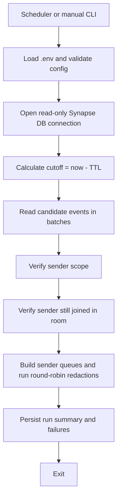
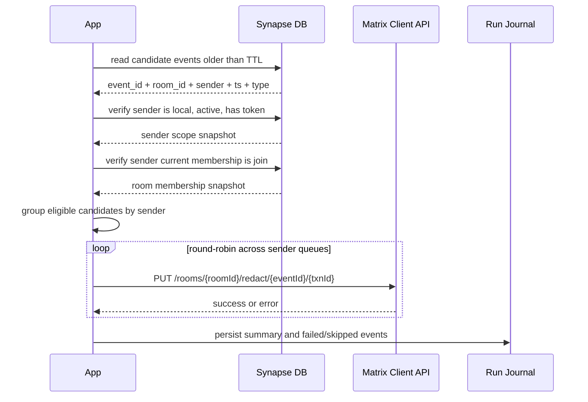

# Архитектура

## 1. Базовое требование

Сообщение должно исчезать у клиентов через штатный Matrix-механизм, а не через прямое изменение `Synapse DB`.

Из этого следуют два правила:

- `Synapse DB` используется только для поиска и preflight-проверок;
- фактическое удаление выполняется через `PUT /_matrix/client/v3/rooms/{roomId}/redact/{eventId}/{txnId}`.

## 2. Выбранная модель исполнения

Текущая реализация использует режим `local_user_access_token`.

Кандидат может быть redaction'ен только если одновременно выполняются все условия:

- отправитель является локальным пользователем данного homeserver;
- пользователь не деактивирован;
- в `Synapse DB` есть хотя бы один валидный access token пользователя;
- пользователь всё ещё состоит в комнате на момент выполнения;
- событие ещё не было redaction'ено ранее.

Если хотя бы одно условие не выполнено, событие пропускается без HTTP-запроса.

## 3. Почему не direct DB delete

- прямое удаление строк не создаёт Matrix redaction event;
- это риск для целостности room graph и производных таблиц `Synapse`;
- такой подход не является штатным способом lifecycle-управления событиями.

## 4. Ограничения модели

В репозитории зафиксирована только одна актуальная архитектура: redaction от имени автора события, если для него доступны условия выполнения.

Из этого следуют два ограничения:

- remote/federated отправители не поддерживаются;
- локальные пользователи, уже покинувшие комнату, не могут redaction'ить свои старые события.

## 5. Компоненты приложения

### Scheduler

Запускает `run-once` по cron-подобному расписанию внутри контейнера.

### Config Loader

Читает `.env`, валидирует TTL, cron, allowlist, DSN и параметры HTTP-клиента.

### Database Reader

Read-only слой на SQLAlchemy Core для:

- выборки событий-кандидатов;
- проверки sender scope;
- проверки текущего membership пользователя в комнате.

### Sender Scope Verifier

Определяет для каждого отправителя:

- локальный он или нет;
- активен ли он;
- есть ли у него валидный access token.

### Room Membership Verifier

Проверяет для каждого кандидата, что текущий membership пользователя в комнате равен `join`.

### Redaction Executor

Для каждого допустимого `event_id`:

- берёт лучший доступный token пользователя;
- не отправляет одновременно несколько redaction для одного и того же sender;
- выполняет разных sender параллельно в round-robin порядке;
- делает redaction через Matrix Client API;
- разделяет permanent и retryable ошибки.

### Run Journal

Хранит локальную информацию о dry-run, real-run, skipped и failed событиях в отдельной БД приложения.

## 6. Поток выполнения

## 7. Последовательность одного batch

## 8. Правило отбора событий

Базовый набор кандидатов:

- `origin_server_ts < cutoff_ms`
- `outlier = false`
- `rejection_reason IS NULL`
- `state_key IS NULL`
- `type IN EVENT_TYPE_ALLOWLIST`
- `room_id NOT IN ROOM_ID_EXCLUDELIST`, если список исключённых комнат задан
- нет записи в `redactions`, где `redactions.redacts = events.event_id`

Allowlist по умолчанию:

- `m.room.encrypted`
- `m.room.message`
- `m.reaction`

## 9. Правило допуска к redaction

Даже если событие прошло базовую SQL-выборку, оно не должно уходить в HTTP, если:

- отправитель remote/federated;
- пользователь деактивирован;
- у пользователя нет валидного access token;
- пользователь уже не состоит в комнате.

Последний пункт особенно важен: текущая membership-проверка должна отсеивать такие события заранее, чтобы не ловить предсказуемый `403 M_FORBIDDEN`.

## 10. Идемпотентность

- события, уже присутствующие в `redactions.redacts`, повторно не планируются;
- scheduler защищён lock file и локальным run journal;
- dry-run и real-run используют один и тот же planner;
- повторный запуск должен быть безопасен.

## 11. Ошибки

### Retryable

- `429`
- `5xx`
- timeout
- транспортные сбои

`429` обрабатывается по `retry_after_ms`, но cooldown применяется только к sender, который получил лимит. Другие sender могут продолжать redaction параллельно.

### Permanent

- remote sender
- deactivated local user
- отсутствие токена
- пользователь не состоит в комнате
- любой неретраимый `4xx`

## 12. Следствие архитектуры

Проект не пытается “пробить” ограничения Matrix через админские обходы. Он либо выполняет redaction в допустимом контексте пользователя, либо явно пропускает событие и пишет причину в run journal.
