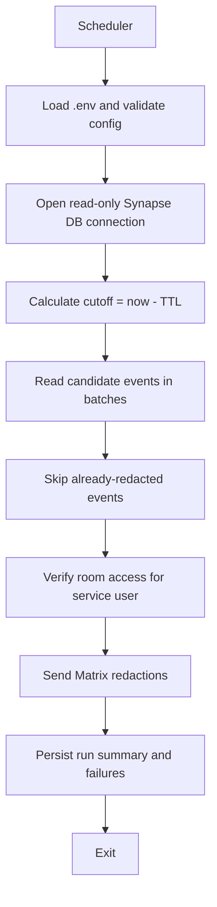
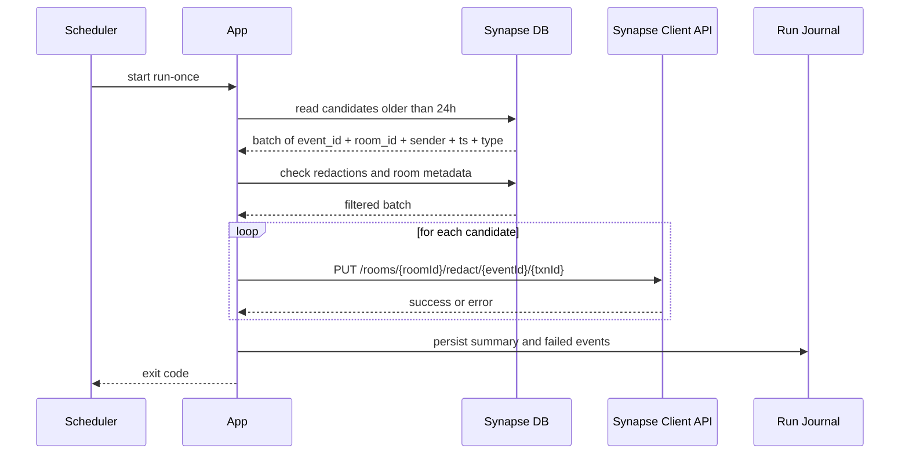

# Архитектура

## 1. Требование, которое фиксирует архитектуру

Целевое поведение:

- сообщение старше `24h` должно исчезать у клиентов;
- это должно работать не только в локальных комнатах, но и в federated rooms;
- приложение должно принимать решение по read-only данным из БД `Synapse`;
- удаление должно выполняться штатным Matrix-механизмом.

Из этого следует главный выбор:

- БД используется только для поиска кандидатов;
- реальное удаление делается через `m.room.redaction`.

## 2. Выбранная архитектурная стратегия

### Chosen path

- `Synapse DB` используется как источник правды для отбора событий.
- Приложение не пишет в `Synapse DB`.
- Для каждого найденного `event_id` создаётся redaction через Matrix Client API.
- Для строгого federated-режима приложение работает от имени сервисного Matrix-пользователя.

### Почему не direct DB delete

- `Synapse` хранит room graph, state, auth chain и производные структуры;
- прямое удаление строк из `events` и связанных таблиц не является штатной операцией;
- это не создаёт federated redaction event и не гарантирует корректный клиентский результат.

### Почему не `retention` как основной вариант

- `retention` хорош как room/server TTL-политика;
- но для данного проекта нужен детерминированный механизм с точным списком `event_id`;
- явный redaction лучше подходит для последующего аудита, dry-run и поштучной обработки ошибок.

## 3. Компоненты будущего приложения

### Scheduler

Отвечает только за запуск `run-once` по cron-подобному расписанию.

Рекомендуемая реализация:

- отдельный процесс внутри контейнера на базе `supercronic`;
- тот же image, что и у приложения;
- тот же one-shot command, что и для ручного запуска.

### Config Loader

Читает `.env` и валидирует:

- URL `Synapse`;
- DSN `Synapse` БД;
- токен сервисного пользователя;
- TTL;
- cron schedule;
- batch size;
- allowlist типов событий;
- dry-run флаг.

### Database Reader

Read-only слой на SQLAlchemy Core.

Задачи:

- выбрать события старше порога;
- исключить state events;
- исключить уже redacted events;
- при необходимости фильтровать комнаты или типы событий;
- уметь одинаково работать с SQLite и PostgreSQL.

### Candidate Planner

Формирует план запуска:

- какие события должны быть обработаны в этой итерации;
- какими батчами;
- какие комнаты проблемные уже на этапе preflight;
- сколько redaction-запросов ожидается.

### Room Access Verifier

Проверяет, сможет ли исполнитель реально сделать redaction:

- сервисный пользователь состоит в комнате;
- у него есть право `redact` чужие события;
- комната не находится в известном unsupported-состоянии.

Проверка может быть сделана:

- либо из DB/room state;
- либо через Matrix API;
- либо комбинированно.

### Redaction Executor

Для каждого `event_id` вызывает:

- `PUT /_matrix/client/v3/rooms/{roomId}/redact/{eventId}/{txnId}`

Особенности:

- создаёт уникальный `txnId`;
- выдерживает rate limit и временные сбои;
- разделяет permanent failure и retryable failure;
- не redaction'ит событие второй раз, если оно уже попало в `redactions`.

### Run Journal

Отдельное локальное хранилище приложения, не связанное с `Synapse DB`.

Содержит:

- старт/окончание запуска;
- effective cutoff;
- количество найденных кандидатов;
- количество успешных redaction;
- список ошибок;
- метки dry-run/real-run.

Рекомендуемый формат:

- локальная SQLite БД приложения или `JSONL` + structured logs.

## 4. Поток выполнения

## 5. Последовательность одного запуска

## 6. Правило отбора событий

Базовый набор кандидатов:

- `origin_server_ts < cutoff_ms`
- `outlier = 0`
- `rejection_reason IS NULL`
- `state_key IS NULL`
- `type IN EVENT_TYPE_ALLOWLIST`
- нет записи в `redactions`, где `redactions.redacts = events.event_id`

Рекомендуемый allowlist по умолчанию:

- `m.room.encrypted`
- `m.room.message`
- `m.reaction`

Почему allowlist, а не “все non-state события”:

- это снижает риск случайно redaction'ить служебные event type;
- на текущем сервере почти все пользовательские сообщения уже укладываются в этот набор;
- позднее можно добавить `m.sticker`, `m.poll.start`, `m.poll.response` и другие типы через конфиг, а не через переписывание кода.

## 7. Бэтчинг и производительность

Фактические наблюдения на сервере `45.134.27.106`:

- на таблице `events` есть индекс `events_ts` по `origin_server_ts`;
- на таблице `redactions` есть индекс `redactions_redacts`;
- запрос вида “старше cutoff и ещё не redacted” использует оба индекса;
- на момент исследования кандидатов было `32480`.

Из этого следует:

- нельзя грузить все события в память одним списком;
- проход должен идти батчами;
- рекомендуется сортировать по `origin_server_ts ASC`, чтобы идти от самых старых событий;
- для первого релиза разумный `BATCH_SIZE`: `200` или `500`.

Отдельная rollout-оговорка:

- первый запуск на уже существующей истории может обрабатывать крупный backlog;
- backlog run и обычный ежедневный run надо воспринимать как разные по нагрузке режимы;
- при первичном включении полезно иметь отдельный dry-run summary и, при необходимости, временно более консервативный batch size.

## 8. Идемпотентность

Приложение должно быть безопасно при повторном запуске.

Основные механизмы:

- события, уже присутствующие в `redactions.redacts`, повторно не планируются;
- каждый run фиксирует свой `run_id`;
- один и тот же запуск не должен идти параллельно с другим;
- dry-run и real-run имеют одинаковый планировщик, но разный исполнитель.

## 9. Защита от overlap

Даже если scheduler настроен на один запуск в сутки, overlap надо запретить.

Рекомендуемый механизм:

- lock file в `APP_STATE_DIR`;
- плюс запись `run_status=running` в локальном state store.

Если lock уже занят:

- второй запуск завершается без redaction;
- это фиксируется в логе как skipped run.

## 10. Ошибки и повторные попытки

Ошибки надо разделять как минимум на две группы.

### Retryable

- временная недоступность `Synapse`;
- `5xx`;
- timeout;
- сетевые сбои;
- rate limiting.

### Permanent

- пользователь не состоит в комнате;
- недостаточный `power level`;
- событие уже redacted к моменту запроса;
- комната недоступна сервисному пользователю.

Поведение:

- retryable ошибки попадают в retry policy текущего запуска;
- permanent ошибки пишутся в итоговый отчёт и не ретраятся бесконечно.

## 11. Безопасность

- подключение к `Synapse DB` только read-only;
- SQLite-путь монтируется в контейнер как `:ro`;
- токен сервисного пользователя хранится в `.env` или secret file, не в коде;
- приложение не должно логировать полный access token;
- причина redaction должна быть нейтральной и предсказуемой, например `Expired by policy`.

## 12. Архитектурный итог

Будущее приложение строится вокруг трёх чётко разделённых слоёв:

- read-only выборка кандидатов из `Synapse DB`;
- проверка доступа и планирование батчей;
- redaction через Matrix API.

Это даёт:

- переносимость между SQLite и PostgreSQL;
- предсказуемый клиентский эффект;
- возможность dry-run, аудита и безопасной эксплуатации.
